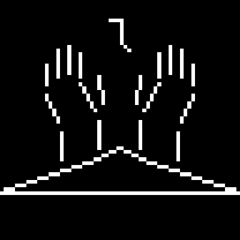

# 3Sisters-Engine
A Lightweight 2D OpenGL based Framework/Engine for Graphics or Video Game Development. 

# Why?

This Framework/Engine was made to provide as an alternative to using popular Software to make graphics. The philosophy of this project is to both provide speed and ease of use when making anything allowing flexibility and peace of mind for developers by developers. 

# State of the Project

Current Version: 1.3-Release-Candidate

Features:

* Cross-platform building (Windows & Unix/Linux)
* Batch Rendering solution
* Entity Component System
* SDL3
* Controller-Support

Currently this project is built in C/C++ and CMake which does hinder the previosly stated philosophy, however this project will be moving around in terms of in what it is developed on, how it can evolve into something more, and finding waays to keep things simple for not only anyone who works on the project but also those who want to use it.

# The Future

Current Plans:
* Current state will be labelled legacy to allow for easier reference and templating for future iterations 
* Current state of legacy code will recieve documentation and hopefully very soon
* Maintained until every current functionality has covered most edge cases

Future Plans:
* Project will be rebuilt from the ground up in C with very little dependencies.
* Project will stand as a base that can stand on its own and be used as a template for any forks of the project that focus on specific functionality
* Project being rebuilt in C allows for porting into different languages like Rust, Java, Odin, and even Python allowing to reach different audiences and different developers who want to use it.
* Project will always continue to OpenGL (either as a main API or fallback) and have the option for creating WebGL builds using Emscripten 
* (Not fully planned yet or idea may be scrapped) have a flexible plugin system using Lua allowing for plugins that for example: Full Editor Mode, Model viewer, Mod support for stuff made with the project, custom scripting language, and a lot of cool stuff 

What is happening now? 
* Project is undergoing changes, reorganization, and planning

# Documentation
This project is still in development, however they're in the works as the project matures.

# Contribution
This project has yet to include contributors, though GitHub issues can be made to highlight needed modifications or fixes to the engine.

# Licensing
This Project is under the MIT License.

Additional Information:
* Games/Software made using the "3Sisters-Engine", the "3Sisters-Engine"'s license does not apply to the content made with it. If this software's shared or static binary library is included in
  the content of your software, then it's required to include a copyright notice and license statement as part of your documentation.

Additional Restriction:
* If the software is directly modified, the source code is changed, thus, the modified software will no longer hold the name "3Sisters-Engine" nor "Project-Heaven".
  Names such as "3Sisters-Engine-2", "3Sisters-Project" and other variations are unrelated to the original software's identity. However, the modified software must refer back
  to the MIT-licensed original software and the reference must be documented.
* If the software is directly modified, the source code is changed, thus, the modified software will no longer hold the original software's logo. Logos that are
  modified, even a modified version of the original software's logo, is unrelated to the original software's identity.

Disclaimer:
* The above explanations of this software's license terms and implications for its users do not constitute legal advice. The statements only reflect the author's understanding of the software's licensing terms; please refer to a lawyer if you have any questions.
